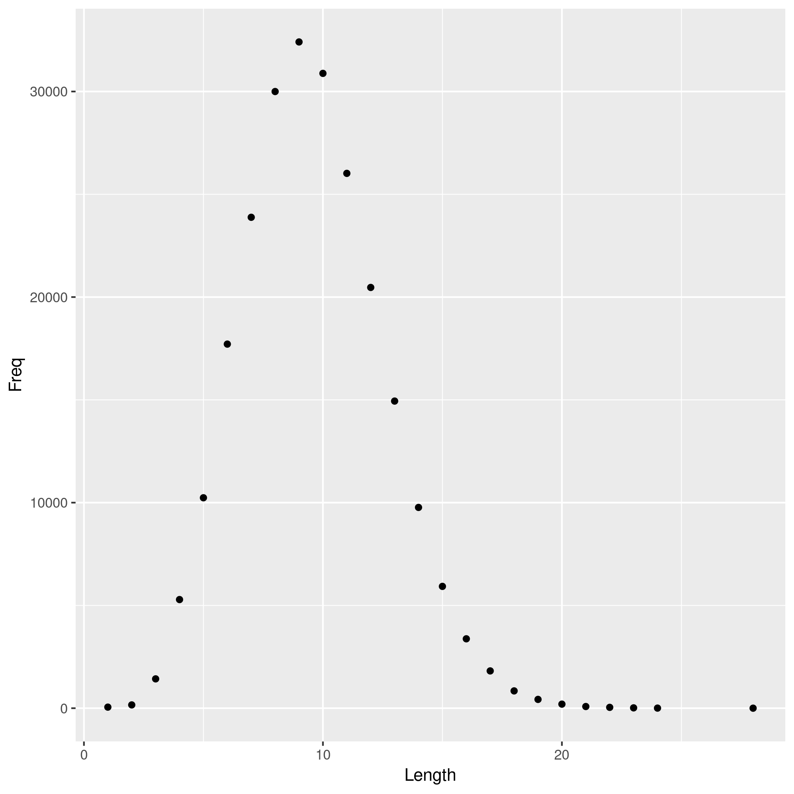

Have you ever wondered what the distribution of Scrabble scores looks like for most words? Why don't we use the dictionary file provided by most Unix-based operating systems to explore this problem.

To keep our run-time reasonable, let's limit our analyses to words that start with 'a' that aren't proper nouns. We will assume for the moment that these words are representative of the distributions of all words that are not proper nouns (which are invalid in Scrabble).

From this we are left with a sample of 14545 words, which range in score from 1 to 50 points before modifiers. Yikes, that doesn't look right. Well that would probably be because this includes words up to 28 letters long! That probably isn't reasonable in a Scrabble game, so let's just look at words up to 9 letters long (since you can have 7 tiles in your hand).

Now we're finally ready. Let's take a look at the distribution of Scrabble scores for valid words that start with 'a' and are less than 10 letters long.

Looks like 11 points is the most common score for valid Scrabble words beginning with 'a' that up to 9 letters long.
